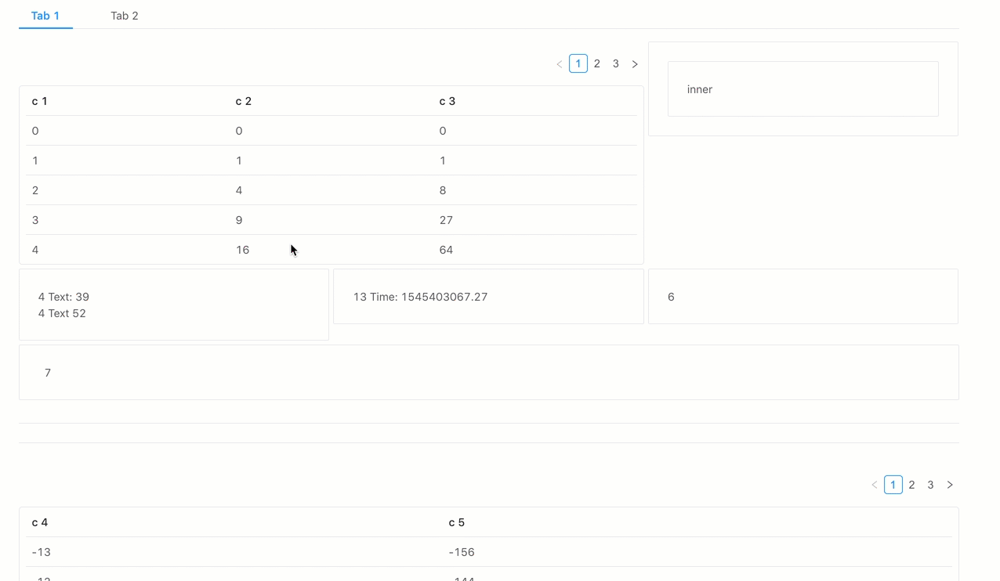
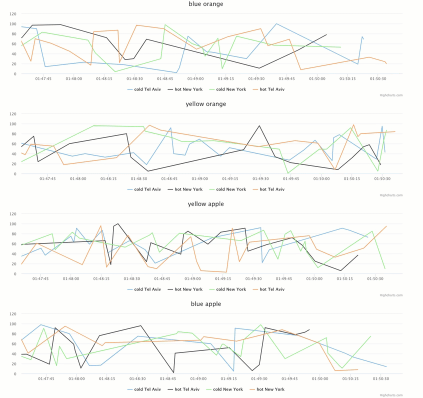

# awe

[](https://circleci.com/gh/dankilman/awe)
[](https://badge.fury.io/py/awe)

Dynamic web based reports/dashboards in python.

## Motivation:

`awe` use cases:
- Create a report for some data you collected in your scripts.
- Poll some data/state in your script and update a chart displaying that data.
- A replacement for print statements in your scripts that can include 
  interactive tables, charts, headers, colors, etc... with minimum fuss.

`awe` isn't for you if you need to:
- Do web development.
- Handle a massive amount of data. `awe` is quite wasteful in terms of resources. This works
  well for small-ish amounts of data. On the other hand, charts with many points will
  probably make your browser completely unresponsive (not benchmarked yet, just a hunch).

Under the hood, `awe` generates the page using react.

## Why is it named `awe`?

I like short names. I initially called this package `pages` but then discovered it is already taken in `pypi`.
Finding a decent unused name is not an easy task!


## Installation
```bash
pip install awe
```

## Getting Started

The basic idea in `awe` is that you create an `awe.Page()` instance in the beginning of your script. e.g:

```python
from awe import Page
page = Page()
```

The page is built by creating a hierarchy of elements. Every element, including the root `Page` element, exposes
`new_XXX()` methods that create element children.

These methods can create leaf elements such as `new_text()`, `new_table()`, etc... e.g:

```python
page.new_text('Hello there')
```

They can also create container elements such as `new_tabs()`, `new_card()` etc... e.g:

```python
card = page.new_card()
```

If you don't intend to dynamically add data to an element, you can simply call the `new_XXX()` method with appropriate
arguments and be done with it.

If you do plan on adding data dynamically or create some element hierarchy, then keep a reference to the created
element, returned by the `new_XXX()` call. e.g:

```python
card = page.new_card()
text = card.new_text('Text inside of card')
button = card.new_button(lambda: None)
```

The above creates a card as a child element of `page` and `text` and `button` elements as children of `card`.

Once you're done with the initial page setup, call `page.start()`. e.g:

```python
# The default call will open a browser page without blocking the script
page.start()

# This will block the script
page.start(block=True)

# This will prevent the default browser open behavior
page.start(open_browser=False)
```

The following examples can be used as reference for the different elements that can be created with `awe`.

## Examples


### [`hello_world.py`](examples/hello_world.py)
The most basic page with a single text element.

```python
from awe import Page

page = Page()
page.new_text('Hello World!')
page.start(block=True)

 ```


### [`button_and_input.py`](examples/button_and_input.py)
A page with a button and two inputs.

Clicking the button or hitting enter when the second input is focused, runs `do_stuff`
which gets a reference to the input values and the button element using the `@inject` decorator.

`do_stuff` in turn, updates the button text.

```python
from awe import Page, inject


@inject(variables=['input1', 'input2'], elements=['button1'])
def do_stuff(input1, input2, button1):
    text = '{} {} {}'.format(button1.count, input1, input2)
    button1.text = text
    button1.count += 1


def main():
    page = Page()
    b = page.new_button(do_stuff, id='button1')
    b.count = 0
    page.new_input(id='input1')
    page.new_input(
        placeholder='Input 2, write anything!',
        on_enter=do_stuff,
        id='input2'
    )
    page.start(block=True)


if __name__ == '__main__':
    main()

 ```


### [`chart_simple.py`](examples/chart_simple.py)
A page with a single chart.

The chart is initialized with a single data item and then updated every 1 second with a new data item.

The data added to the chart is transformed by the `numbers` transformer. It builds a single chart with series
built from each value in the data item (which is a list of numbers)

```python
import time
from random import randint

from awe import Page


def generate_random_data(size, num_series):
    result = []
    for _ in range(size):
        item = []
        for i in range(num_series):
            item.append(randint(i*100, i*100 + 100))
        result.append(item)
    return result


def main():
    args = (1, 3)
    page = Page()
    data = generate_random_data(*args)
    chart = page.new_chart(data=data, transform='numbers')
    page.start()
    while True:
        time.sleep(1)
        chart.add(generate_random_data(*args))


if __name__ == '__main__':
    main()

 ```


### [`chart_complex.py`](examples/chart_complex.py)
A page with a single chart.

The chart is initialized with a single data item and then updated every 5 seconds.

The chart has a moving time window of 3 minutes.

The data added to the chart is transformed by the `2to31` transformer. It builds charts from the different keys
of the 2nd level in the nested dictionary data items. It builds the chart series from the different combinations
of the 3rd and 1st levels in the nested dictionary data items.

In general, every `[Ns...]to[Ms...]` transformer is supported.

```python
import time
from random import randint

from awe import Page


def generate_random_data(size):
    level3 = lambda: {'l3_key1': randint(0, 1000), 'l3_key2': randint(0, 1000)}
    level2 = lambda: {'l2_key1': level3(), 'l2_key2': level3(), 'l2_key3': level3()}
    level1 = lambda: {'l1_key1': level2(), 'l1_key2': level2()}
    return [level1() for _ in range(size)]


def main():
    page = Page()
    data = generate_random_data(1)
    chart = page.new_chart(data=data, transform='2to31', moving_window=3 * 60)
    page.start()
    while True:
        time.sleep(5)
        chart.add(generate_random_data(1))


if __name__ == '__main__':
    main()

 ```


### [`kitchen.py`](examples/kitchen.py)
A page that showcases many different element types supported by `awe`.

The following element types are used:

- tabs
- grids
- dividers
- cards
- texts
- tables

Element data is updated using API exposed by each element type.

In addition, the `divider` element is updated using the lower level `element.update_prop()` method which updates
the underlying props of the react component.

```python
import time

from awe import Page


class Kitchen(object):
    def __init__(self, parent):
        self.tabs = parent.new_tabs()
        self.tab1 = Tab1(self.tabs)
        self.tab2 = Tab2(self.tabs)

    def update(self, i):
        self.tab1.update(i)
        self.tab2.update(i)


class Tab1(object):
    def __init__(self, parent):
        self.tab = parent.new_tab('Tab 1')
        self.grid = Grid(self.tab)
        self.divider = self.tab.new_divider()
        self.divider2 = self.tab.new_divider()
        self.table2 = self.tab.new_table(headers=['c 4', 'c 5'], page_size=5)

    def update(self, i):
        self.divider.update_prop('dashed', not self.divider.props.get('dashed'))
        self.table2.prepend([-i, -i * 12])
        self.grid.update(i)


class Grid(object):
    def __init__(self, parent):
        self.grid = parent.new_grid(columns=3)
        self.table1 = self.grid.new_table(headers=['c 1', 'c 2', 'c 3'], cols=2, page_size=5)
        self.cc = self.grid.new_card()
        self.cc_inner = self.cc.new_card('inner')
        self.ct = self.grid.new_card()
        self.t1 = self.ct.new_text('4 Text')
        self.t2 = self.ct.new_text('4 Text 2')
        self.card = self.grid.new_card('0 Time')
        self.card2 = self.grid.new_card('6')
        self.card3 = self.grid.new_card('7', cols=3)

    def update(self, i):
        self.table1.append([i, i ** 2, i ** 3])
        self.card.text = '{} Time: {}'.format(i, time.time())
        self.t1.text = '4 Text: {}'.format(i * 3)
        self.t2.text = '4 Text {}'.format(i * 4)


class Tab2(object):
    def __init__(self, parent):
        self.tab = parent.new_tab('Tab 2')
        self.table3 = self.tab.new_table(headers=['c 6', 'c 7', 'c 8'], page_size=5)
        self.table4 = self.tab.new_table(headers=['c 2', 'c 5'], page_size=5)

    def update(self, i):
        self.table3.append([-i, -i ** 2, -i ** 3])
        self.table4.append([i, i * 12])


def main():
    page = Page()
    kitchen = Kitchen(page)
    page.start()
    try:
        for i in range(1000):
            print i
            kitchen.update(i)
            time.sleep(5)
    except KeyboardInterrupt:
        pass


if __name__ == '__main__':
    main()

 ```


### [`page_properties.py`](examples/page_properties.py)
A page that demonstrates how to set the page title, width and override its style.

```python
from awe import Page


def main():
    page = Page('Page Properties', width=600, style={
        'backgroundColor': 'red'
    })
    page.new_card('hello')
    page.start(block=True)


if __name__ == '__main__':
    main()

 ```


### [`standard_output.py`](examples/standard_output.py)
A page that demonstrates adding text dynamically to a page after it has been started.

The elements are created with a custom style.
 
```python
import time

from awe import Page


def main():
    page = Page()
    page.start()
    page.new_text('Header', style={'fontSize': '1.5em', 'color': '#ff0000'})
    for i in range(20):
        page.new_text('{} hello {}'.format(i, i), style={'color': 'blue'})
        time.sleep(2)
    page.block()


if __name__ == '__main__':
    main()

 ```


### [`collapse.py`](examples/collapse.py)
A page with a single collapse element. 

The collapse has 3 panels. The first panel defaults to being expanded. The other two panels default to collapsed.

```python
from awe import Page


def main():
    page = Page()
    collapse = page.new_collapse()
    panel1 = collapse.new_panel('Panel 1', active=True)
    panel1.new_text('Hello From Panel 1')
    panel2 = collapse.new_panel('Panel 2', active=False)
    panel2.new_text('Hello From Panel2')
    panel3 = collapse.new_panel('Panel 3')
    panel3.new_text('Hello From Panel3')
    page.start(block=True)


if __name__ == '__main__':
    main()

 ```


### [`chart_flat.py`](examples/chart_flat.py)
A page with a single chart.

The chart is initialized with a single data item and then updated every 0.7 seconds with a new data item.

The chart has a moving time window of 3 minutes.

The data added to the chart is transformed by the `flat` transformer. It builds charts from the different combinations
of the `chart_mapping` list. It builds the chart series from the different combinations
of the `series_mapping` list. The values are extracted from the `value_key` key.

```python
import time
import random

from awe import Page


def generate_random_data():
    return [{
        'color': random.choice(['blue', 'yellow']),
        'fruit': random.choice(['apple', 'orange']),
        'temp': random.choice(['cold', 'hot']),
        'city': random.choice(['Tel Aviv', 'New York']),
        'value': random.randint(1, 100)
    }]


def main():
    page = Page()
    data = generate_random_data()
    chart = page.new_chart(data=data, transform={
        'type': 'flat',
        'chart_mapping': ['color', 'fruit'],
        'series_mapping': ['temp', 'city'],
        'value_key': 'value'
    }, moving_window=3 * 60)
    page.start()
    while True:
        time.sleep(0.7)
        chart.add(generate_random_data())


if __name__ == '__main__':
    main()

 ```

