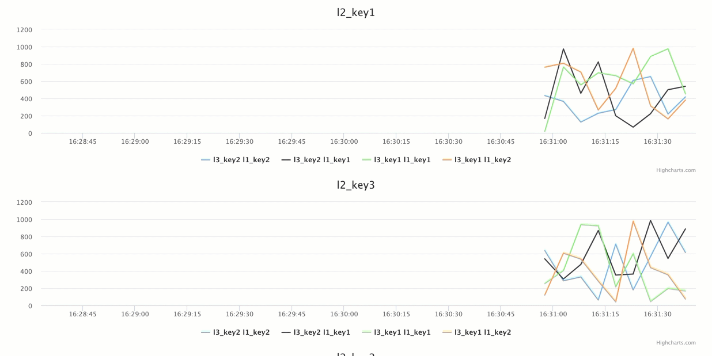

# awe

Dynamic web based reports/dashboards in python.

## Motivation:

awe usa cases:
- Create a report for some data you collected in your scripts.
- Poll some data/state in your script and update a chart displaying that data.
- A replacement for print/log statements in your scripts that can include 
  interactive tables, charts, headers, colors, etc... with minimum fuss.

awe isn't for you if you need to:
- Do web development.
- Handle a massive amount of data. awe is quite wasteful in terms of resources. This works
  well for small-ish amounts of data. On the other hand, charts with many of points will
  probably make your browser completely unresponsive (not benchmarked yet, just a hunch).

Under the hood, awe generates the page using react.

## Installation
```bash
pip install awe
```

## Examples

### [`button_and_input.py`](examples/button_and_input.py)


### [`chart_simple.py`](examples/chart_simple.py)


### [`chart_complex.py`](examples/chart_complex.py)


### [`kitchen.py`](examples/kitchen.py)


### [`page_properties.py`](examples/page_properties.py)


### [`standard_output.py`](examples/standard_output.py)

