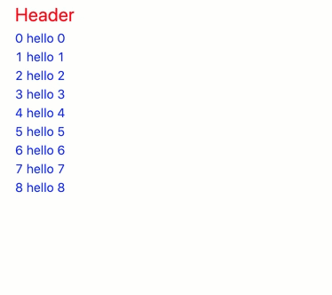

# awe

Dynamic web based reports/dashboards in python.

## Motivation:

awe use cases:
- Create a report for some data you collected in your scripts.
- Poll some data/state in your script and update a chart displaying that data.
- A replacement for print statements in your scripts that can include 
  interactive tables, charts, headers, colors, etc... with minimum fuss.

awe isn't for you if you need to:
- Do web development.
- Handle a massive amount of data. awe is quite wasteful in terms of resources. This works
  well for small-ish amounts of data. On the other hand, charts with many points will
  probably make your browser completely unresponsive (not benchmarked yet, just a hunch).

Under the hood, awe generates the page using react.

## Installation
```bash
pip install awe
```

## Hello World
The most basic functional example would be something like this:
```python
from awe import Page

page = Page()
page.new_text('Hello World!')
page.start(block=True)
```

Which produces this exciting output:


## Examples


### [`button_and_input.py`](examples/button_and_input.py)
```python
from awe import Page, inject


@inject(variables=['input1', 'input2'], elements=['button1'])
def do_stuff(input1, input2, button1):
    text = '{} {} {}'.format(button1.count, input1, input2)
    button1.text = text
    button1.count += 1


def main():
    page = Page()
    b = page.new_button(do_stuff, id='button1')
    b.count = 0
    page.new_input(id='input1')
    page.new_input(
        placeholder='Input 2, write anything!',
        on_enter=do_stuff,
        id='input2'
    )
    page.start(block=True)


if __name__ == '__main__':
    main()

 ```


### [`chart_simple.py`](examples/chart_simple.py)
```python
import time
from random import randint

from awe import Page


def generate_random_data(size, num_series):
    result = []
    for _ in range(size):
        item = []
        for i in range(num_series):
            item.append(randint(i*100, i*100 + 100))
        result.append(item)
    return result


def main():
    args = (1, 3)
    page = Page()
    data = generate_random_data(*args)
    chart = page.new_chart(data=data, transform='numbers')
    page.start()
    while True:
        time.sleep(1)
        chart.add(generate_random_data(*args))


if __name__ == '__main__':
    main()

 ```


### [`chart_complex.py`](examples/chart_complex.py)
```python
import time
from random import randint

from awe import Page


def generate_random_data(size):
    level3 = lambda: {'l3_key1': randint(0, 1000), 'l3_key2': randint(0, 1000)}
    level2 = lambda: {'l2_key1': level3(), 'l2_key2': level3(), 'l2_key3': level3()}
    level1 = lambda: {'l1_key1': level2(), 'l1_key2': level2()}
    return [level1() for _ in range(size)]


def main():
    page = Page()
    data = generate_random_data(1)
    chart = page.new_chart(data=data, transform='2to31', moving_window=3 * 60)
    page.start()
    while True:
        time.sleep(5)
        chart.add(generate_random_data(1))


if __name__ == '__main__':
    main()

 ```


### [`kitchen.py`](examples/kitchen.py)
```python
import time

from awe import Page


class Kitchen(object):
    def __init__(self, parent):
        self.tabs = parent.new_tabs()
        self.tab1 = Tab1(self.tabs)
        self.tab2 = Tab2(self.tabs)

    def update(self, i):
        self.tab1.update(i)
        self.tab2.update(i)


class Tab1(object):
    def __init__(self, parent):
        self.tab = parent.new_tab('Tab 1')
        self.grid = Grid(self.tab)
        self.divider = self.tab.new_divider()
        self.divider2 = self.tab.new_divider()
        self.table2 = self.tab.new_table(headers=['c 4', 'c 5'], page_size=5)

    def update(self, i):
        self.divider.update_prop('dashed', not self.divider.props.get('dashed'))
        self.table2.prepend([-i, -i * 12])
        self.grid.update(i)


class Grid(object):
    def __init__(self, parent):
        self.grid = parent.new_grid(columns=3)
        self.table1 = self.grid.new_table(headers=['c 1', 'c 2', 'c 3'], cols=2, page_size=5)
        self.cc = self.grid.new_card()
        self.cc_inner = self.cc.new_card('inner')
        self.ct = self.grid.new_card()
        self.t1 = self.ct.new_text('4 Text')
        self.t2 = self.ct.new_text('4 Text 2')
        self.card = self.grid.new_card('0 Time')
        self.card2 = self.grid.new_card('6')
        self.card3 = self.grid.new_card('7', cols=3)

    def update(self, i):
        self.table1.append([i, i ** 2, i ** 3])
        self.card.text = '{} Time: {}'.format(i, time.time())
        self.t1.text = '4 Text: {}'.format(i * 3)
        self.t2.text = '4 Text {}'.format(i * 4)


class Tab2(object):
    def __init__(self, parent):
        self.tab = parent.new_tab('Tab 2')
        self.table3 = self.tab.new_table(headers=['c 6', 'c 7', 'c 8'], page_size=5)
        self.table4 = self.tab.new_table(headers=['c 2', 'c 5'], page_size=5)

    def update(self, i):
        self.table3.append([-i, -i ** 2, -i ** 3])
        self.table4.append([i, i * 12])


def main():
    page = Page()
    kitchen = Kitchen(page)
    page.start()
    try:
        for i in range(1000):
            print i
            kitchen.update(i)
            time.sleep(5)
    except KeyboardInterrupt:
        pass


if __name__ == '__main__':
    main()

 ```


### [`page_properties.py`](examples/page_properties.py)
```python
from awe import Page


def main():
    page = Page('Page Properties', width=600, style={
        'backgroundColor': 'red'
    })
    page.new_card('hello')
    page.start(block=True)


if __name__ == '__main__':
    main()

 ```


### [`standard_output.py`](examples/standard_output.py)
```python
import time

from awe import Page


def main():
    page = Page()
    page.start()
    page.new_text('Header', style={'fontSize': '1.5em', 'color': '#ff0000'})
    for i in range(20):
        page.new_text('{} hello {}'.format(i, i), style={'color': 'blue'})
        time.sleep(2)
    page.block()


if __name__ == '__main__':
    main()

 ```


### [`collapse.py`](examples/collapse.py)
```python
from awe import Page


def main():
    page = Page()
    collapse = page.new_collapse()
    panel1 = collapse.new_panel('Panel 1', active=True)
    panel1.new_text('Hello From Panel 1')
    panel2 = collapse.new_panel('Panel 2', active=False)
    panel2.new_text('Hello From Panel2')
    panel3 = collapse.new_panel('Panel 3')
    panel3.new_text('Hello From Panel3')
    page.start(block=True)


if __name__ == '__main__':
    main()

 ```

